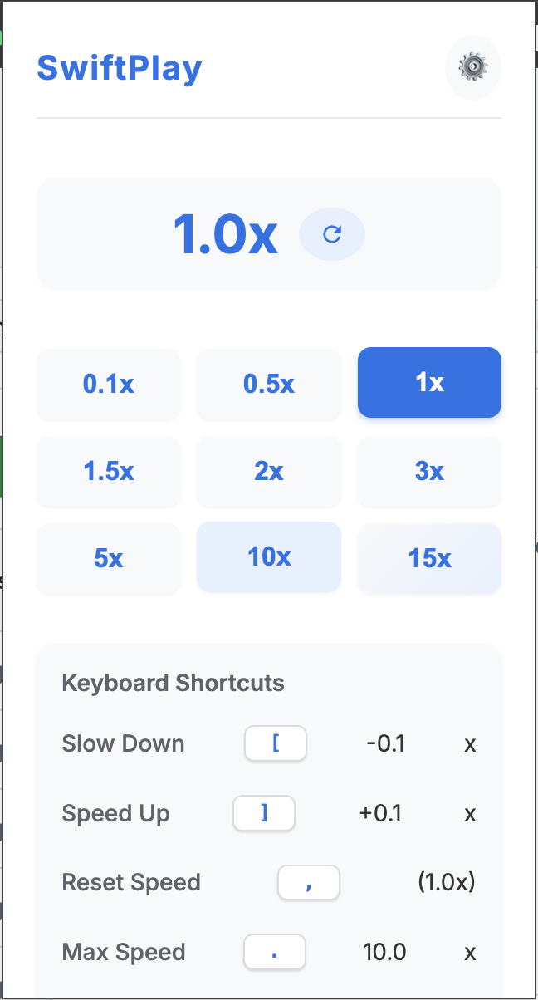

# SwiftPlay 🎮

<div align="center">
  
  <h3>Take control of video playback speed on any website</h3>
  
  
  
  
</div>

<p align="center">
  
</p>

## ✨ Features

- **Keyboard Shortcuts**: Instantly adjust playback speed while watching videos
  - <kbd>A</kbd>: Slow down by 0.1x (customizable)
  - <kbd>S</kbd>: Speed up by 0.1x (customizable)
  - <kbd>,</kbd>: Reset to 1.0x
  - <kbd>.</kbd>: Jump to max speed (default: 10.0x)
- **Beautiful UI**: Modern, clean interface with smooth animations
- **Fully Customizable**: Personalize shortcuts and speed increments
- **Universal Compatibility**: Works on YouTube, Netflix, Vimeo, and all major video platforms
- **Speed Badge**: Always see your current speed in the extension badge
- **Privacy-Focused**: No data collection, tracking, or analytics

## 📥 Installation

### Chrome Web Store (Recommended)
1. Visit the [SwiftPlay Chrome Web Store page](https://chrome.google.com/webstore/detail/swiftplay)
2. Click "Add to Chrome"
3. Start controlling video speed on any website!

### Manual Installation
1. Download the latest release from [GitHub Releases](https://github.com/samyak0101/SwiftPlay/releases)
2. Unzip the file
3. In Chrome, go to `chrome://extensions/`
4. Enable "Developer mode" (toggle in the top-right corner)
5. Click "Load unpacked" and select the unzipped folder
6. SwiftPlay is now installed!

### Build From Source
If you prefer to build from source:

1. Clone this repository:
   ```
   git clone https://github.com/samyak0101/SwiftPlay.git
   ```

2. Prepare the extension:
   ```
   cd SwiftPlay
   ```
   
3. Open Chrome and navigate to `chrome://extensions/`

4. Enable "Developer mode" (toggle in the top-right corner)

5. Click "Load unpacked" and select the SwiftPlay directory

6. The extension should now appear in your extensions list and browser toolbar

Note: When building from source, any changes you make to the code will be applied after you click the refresh button on the extension card in `chrome://extensions/`.

## 🎯 How to Use

### Basic Usage
1. Navigate to any website with video content
2. Press the keyboard shortcuts (<kbd>A</kbd>/<kbd>S</kbd>/<kbd>,</kbd>/<kbd>.</kbd>) to control playback speed
3. Alternatively, click the SwiftPlay icon in your toolbar to open the popup UI
4. Select a preset speed or use the controls to adjust as needed

### Customizing Shortcuts
1. Click the SwiftPlay icon in your toolbar
2. Click the settings icon (⚙️) in the top-right corner
3. Customize your keyboard shortcuts and speed increments
4. Click "Save" to apply your changes

<p align="center">
  
</p>

## 🔜 Roadmap

Here are some planned features and enhancements:

### User Experience
- Preset profiles (save and load different shortcut configurations)
- Quick favorites (pin favorite speeds to the top)
- Dark mode support
- Import/export settings

### Functionality
- Fine-grained control with decimal inputs
- Advanced keyboard shortcuts (key combinations)
- Video progress tracking
- Automatic speed adjustment based on content type

### Future Versions
- **v1.5**: Preset profiles, Dark mode, Fine-grained controls
- **v1.6**: Quick favorites, Import/export settings, Advanced shortcuts
- **v2.0**: Complete UI redesign, Automatic speed adjustment

## 🤝 Contributing

Contributions are welcome and greatly appreciated! Here's how you can help:

1. **Fork the Repository**: Start by forking the repo
2. **Create a Feature Branch**: `git checkout -b feature/amazing-feature`
3. **Make Your Changes**: Implement your feature or bug fix
4. **Commit Your Changes**: `git commit -m 'Add some amazing feature'`
5. **Push to the Branch**: `git push origin feature/amazing-feature`
6. **Open a Pull Request**: Go to GitHub and submit a PR

## 🔒 Privacy Policy

SwiftPlay does not collect, store, or transmit any personal data. All functionality runs locally in your browser. No analytics, tracking, or third-party services are used.

## 📝 License

This project is licensed under the MIT License - see the [LICENSE](LICENSE.md) file for details.

## 🙏 Acknowledgements

- All our amazing users and contributors
- The Chrome Extensions API team for their excellent documentation
- Open source community for inspiration and support

## 📮 Contact

Have questions, feedback, or feature requests? Open an issue or contact the maintainers:

- GitHub Issues: [Create an issue](https://github.com/samyak0101/SwiftPlay/issues)
- Email: [samyak.jain@example.com](mailto:samyak.jain@example.com)

---

<p align="center">
  Made with ❤️ by <a href="https://github.com/samyak0101">Samyak Jain</a>
</p> 